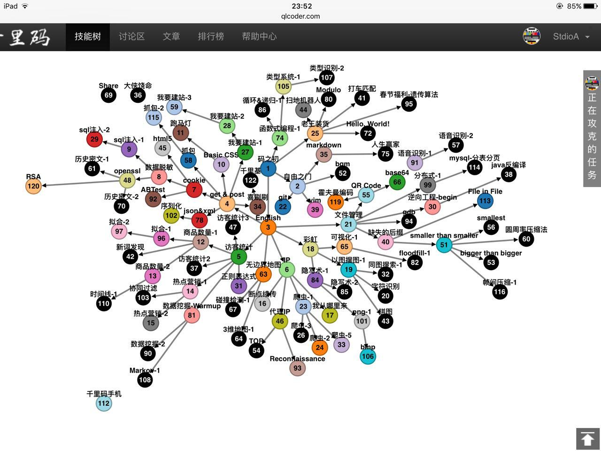

# 千里码题解
本 Repo 是[千里码](http://www.qlcoder.com/)部分题目的题解。  
绝大部分题是我在 2016 年做的，所以大部分题解使用了 Python 2.  
没有费心思整理，所以目录结构比较乱，见谅。

千里码网站已于 2019 年 2 月关闭。  
很遗憾没有在最后时刻截取自己的技能树截图，只剩下了这一张截图，来自 2016 年 5 月 1 日。

在此之后完成的题目有：
* Java 反编译
* 语音识别 2
* 数据挖掘 2
* Hello, World! (qll 语言)
* bgm
* gdb
* Chinese Trie
* Dockerfile
* Code Review - 1 & 2
* 漏洞利用（题目记不清了，利用的是 Redis 的一个[漏洞](http://blog.knownsec.com/2015/11/analysis-of-redis-unauthorized-of-expolit/)）
